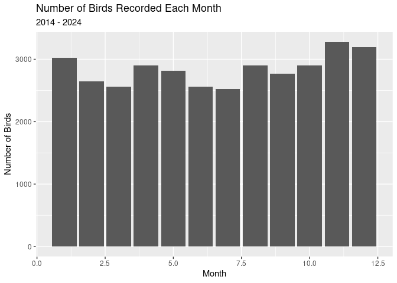

Project proposal
================
Adler and Jackie

``` r
library(tidyverse)
library(broom)
library(readxl)
library(dplyr)
```

## 1. Introduction

The data is of the presence of birds around an aquaculture farm, to see
if the aquaculture farm impacted the population of birds in the area,
and if those bird populations were negatively impacted by the planes
coming from the nearby airport. It was collected by John Anderson and a
group of research assistants. They went out a few days each month, and
for an hour they collected data on the environmental factors (including
temperature, wind), the tide, and what species were observed.

We are looking to explore any patterns in the presence of bird species,
and which birds are found in specific whether conditions.

## 2. Data

``` r
seabird_count <- read_excel("../data/Copy of Trenton seabird count_nov 2014-2023.xls")
```

    ## Warning: Expecting numeric in F132 / R132C6: got a date

    ## Warning: Expecting numeric in F284 / R284C6: got a date

    ## Warning: Expecting numeric in F285 / R285C6: got a date

    ## Warning: Expecting numeric in F293 / R293C6: got a date

    ## Warning: Expecting numeric in F301 / R301C6: got a date

    ## Warning: Expecting numeric in F416 / R416C6: got a date

    ## Warning: Expecting numeric in F417 / R417C6: got a date

    ## Warning: Expecting numeric in F418 / R418C6: got a date

    ## Warning: Expecting numeric in F419 / R419C6: got a date

    ## New names:
    ## • `` -> `...17`
    ## • `` -> `...59`
    ## • `` -> `...60`

``` r
seabird_count <- seabird_count %>%
  rename(observer = "OBSERVER",
         date = "DATE",
         hours = "HOURS",
         time = "TIME",
         temp = "TEMP (F)",
         wind_speed = "WIND SPEED (mph)",
         wind_direction = "WIND DIRECTION",
         tide_obs = "TIDE OBS",
         tide_percentage = "TIDE %",
         weather_obs = "WEATHER OBS",
         weather_percentage = "WEATHER %",
         precipitation = "PRECIPITATION",
         total = "Total",
         herring_gull = "Herring Gull",
         laughing_gull = "Laughing Gull",
         great_black_backed_gull = "Great Black-backed Gull",
         red_throated_loon = "red throated loon",
         common_loon = "Common Loon",
         long_tailed_duck = "Long-tailed Duck",
         red_breasted_merganser = "Red breasted Merganser",
         common_merganser = "Common Merganser",
         black_duck = "Black Duck",
         surf_scoter = "surf scoter",
         common_eider = "Common Eider",
         bufflehead = "Bufflehead",
         goldeneye = "Goldeneye",
         lesser_scaup = "Lesser Scaup",
         black_scoter = "Black Scoter",
         white_winged_scoter = "White-Winged Scoter",
         red_necked_grebe = "Red-Necked Grebe",
         horned_grebe = "Horned Grebe",
         bonapartes_gull = "Bonaparte's Gull",
         belted_kingfisher = "Belted Kingfisher",
         common_tern = "Common Tern",
         ring_billed_gull = "Ring-Billed Gull",
         canada_goose = "Canada Goose", 
         great_blue_heron = "Great Blue Heron",
         double_crested_cormorant = "Double-Crested Cormorant",
         common_crow = "Common Crow",
         black_guillemot = "Black Guillemot",
         osprey = "Osprey",
         mallard_duck = "Mallard Duck",
         spotted_sandpiper = "Spotted Sandpiper",
         semipalmated_plover = "Semipalmated Plover",
         bald_eagle = "Bald Eagle",
         red_tailed_hawk = "Red-Tailed hawk",
         turkey_vulture = "Turkey Vulture",
         rough_legged_hawk = "rough legged hawk",
         harrier = "Harrier",
         kestrel = "Kestrel",
         turkey = "Turkey",
         unidentifiable_duck = "Unidentifiable Duck",
         unidentifiable = "Unidentifiable (too far to ID)")
```

``` r
seabird_count <- seabird_count %>%
 select(-"...17", -"COMMENTS", -"...59", -"...60") %>%
  slice(-1) %>%
mutate(across(total:unidentifiable, as.numeric)) %>%
  pivot_longer(
    cols = total:unidentifiable,
      names_to = "species",
   values_to = "count")
```

    ## Warning: There were 3 warnings in `mutate()`.
    ## The first warning was:
    ## ℹ In argument: `across(total:unidentifiable, as.numeric)`.
    ## Caused by warning:
    ## ! NAs introduced by coercion
    ## ℹ Run `dplyr::last_dplyr_warnings()` to see the 2 remaining warnings.

``` r
seabird_count_tidy <- seabird_count %>%
  mutate(weather_obs_original = weather_obs) %>%
  mutate(weather_obs = case_when(str_detect(weather_obs, pattern = "clear|sunny") ~ "clear",
                              str_detect(weather_obs, pattern = "driz|rain") ~ "rain",
                              str_detect(weather_obs, pattern = "fog|haz") ~ "foggy",
                              str_detect(weather_obs, pattern = "over") ~ "overcast",
                              str_detect(weather_obs, pattern = "clou|clod") ~ "cloudy",
                              TRUE ~ weather_obs)) %>%
  mutate(tide_obs_original = tide_obs) %>% 
  mutate(tide_obs = case_when(str_detect(tide_obs, pattern = "half|med") ~ "mid",
                              str_detect(tide_obs, pattern = "hig|thre") ~ "high",
                              str_detect(tide_obs, pattern = "low|one|thi|qua") ~ "low",
                              TRUE ~ tide_obs)) %>% 
  mutate(month = as.character(month)) %>% 
  mutate(month_orginal = month) %>% 
  mutate(month = case_when(str_detect(month, pattern = "12|1|2") ~ "winter",
                           str_detect(month, pattern = "3|4|5") ~ "spring",
                           str_detect(month, pattern = "6|7|8") ~ "summer",
                           str_detect(month, pattern = "9|10|11") ~ "fall",
                           TRUE ~ month)) %>% 
  rename(season = month) %>% 
  mutate(count_orginial = count) %>% 
  mutate(count = ifelse(is.na(count), 0, count)) %>% 
  
  # ^creating a copy of the variable to save it, edited the original data to have correct labels 
  mutate(wind_direction_clean = case_when(wind_direction %in% c("5", "10", "15","calm") ~ wind_speed,
                                          TRUE ~ wind_direction)) %>%
  mutate(wind_speed_clean = case_when(wind_speed %in% c("n", "s", "e", "w", "sw", "nw", "ne") ~ wind_direction,
                                          TRUE ~ wind_speed)) 

  # ^wind direction and speed were switched for some observations: created a new variable for the case when in wind_direction certain observations were found and copied them to wind_speed and then in a new line doing the inverse to copy the wind_speed to wind_direction


seabird_count_tidy <- seabird_count %>%
  mutate(count = str_replace_na(count, "0")) %>%
  mutate(count = as.double(count)) %>%
  mutate(species = str_replace(species, "Surf Scoter", "surf_scoter")) %>%
  mutate(tide_obs = str_replace(tide_obs, "half", "mid")) %>%
  mutate(tide_obs = str_replace(tide_obs, "higgh", "high")) %>% 
  mutate(tide_obs = str_replace(tide_obs, "hightide", "high")) %>% 
  mutate(tide_obs = str_replace(tide_obs, "mid-high", "high")) %>%
  mutate(tide_obs = str_replace(tide_obs, "thre quarters", "high")) %>%
  mutate(tide_obs = str_replace(tide_obs, "three quarters", "high")) %>%
  mutate(tide_obs = str_replace(tide_obs, "threequarters", "high")) %>%
  mutate(tide_obs = str_replace(tide_obs, "med", "mid")) %>%
  mutate(tide_obs = str_replace(tide_obs, "mid-low", "low")) %>%
  mutate(tide_obs = str_replace(tide_obs, "[one low mlow]", "low")) %>%
  mutate(tide_obs = str_replace(tide_obs, "one third", "low")) %>%
  mutate(tide_obs = str_replace(tide_obs, "quarter", "low")) %>%
  mutate(tide_obs = str_replace(tide_obs, "third", "low")) %>% 
  mutate(weather_obs = str_replace(weather_obs, "clear, runny", "clear")) %>%
  mutate(weather_obs = str_replace(weather_obs, "clear, sunny", "clear")) %>%
  mutate(weather_obs = str_replace(weather_obs, "sunny, whitecaps present", "clear")) %>%
  mutate(weather_obs = str_replace(weather_obs, "sunny, breezy", "clear")) %>%
  mutate(weather_obs = str_replace(weather_obs, "sunny!", "clear")) %>%
  mutate(weather_obs = str_replace(weather_obs, "few clouds", "clear")) %>%
  mutate(weather_obs = str_replace(weather_obs, "mosly clear", "clear")) %>%
  mutate(weather_obs = str_replace(weather_obs, "mostly sunny", "clear")) %>%
  mutate(weather_obs = str_replace(weather_obs, "clody, breezy, waves 1-2 feet", "cloudy")) %>%
  mutate(weather_obs = str_replace(weather_obs, "cloud", "cloudy")) %>%
  mutate(weather_obs = str_replace(weather_obs, "clouds", "cloudy")) %>%
  mutate(weather_obs = str_replace(weather_obs, "mostly cloudy", "cloudy")) %>%
  mutate(weather_obs = str_replace(weather_obs, "partly coudy", "cloudy")) %>%
  mutate(weather_obs = str_replace(weather_obs, "cloufy", "cloudy")) %>%
  mutate(weather_obs = str_replace(weather_obs, "high cloudy", "cloudy")) %>%
  mutate(weather_obs = str_replace(weather_obs, "hih clouds", "cloudy")) %>%
  mutate(weather_obs = str_replace(weather_obs, "foggy, low visability", "fog")) %>%
  mutate(weather_obs = str_replace(weather_obs, "hazy", "fog")) %>%
  mutate(weather_obs = str_replace(weather_obs, "high haze", "fog")) %>%
  mutate(weather_obs = str_replace(weather_obs, "high overcast", "overcast")) %>%
  mutate(weather_obs = str_replace(weather_obs, "low overcast", "overcast")) %>%
  mutate(weather_obs = str_replace(weather_obs, "cloudy w drizzle", "rain")) %>%
  mutate(weather_obs = str_replace(weather_obs, "cloudy / rain", "rain")) %>% 
  mutate(weather_obs = str_replace(weather_obs, "cloudyy", "cloudy")) %>% 
  mutate(weather_obs = str_replace(weather_obs, "partly cloudyy", "cloudy")) %>% 
  mutate(weather_obs = str_replace(weather_obs, "sunny,", "sunny")) %>% 
  mutate(weather_obs = str_replace(weather_obs, "sunny, white caps present", "sunny")) %>% 
  mutate(weather_obs = str_replace(weather_obs, "clear!", "clear")) %>% 
  mutate(weather_obs = str_replace(weather_obs, pattern = "[rainy|]", "rain")) %>% 
  mutate(weather_obs = str_replace(weather_obs, "mostly clear", "clear")) %>% 
  mutate(weather_obs = str_replace(weather_obs, "cloudys", "cloudy")) %>% 
  mutate(weather_obs = str_replace(weather_obs, "cloudyy, breezy, waves 1-2 feet", "cloudy")) %>% 
  mutate(weather_obs = str_replace(weather_obs, "cloudyy/rain", "cloudy")) %>% 
  mutate(weather_obs = str_replace(weather_obs, "hih cloudy", "cloudy")) %>% 
  mutate(weather_obs = str_replace(weather_obs, "foggy", "fog")) %>% 
  mutate(weather_obs = str_replace(weather_obs, "cloudyy with drizzle   ", "rain")) %>%
  mutate(weather_obs = str_replace(weather_obs, "cloudyy", "cloudy")) %>% 
  mutate(weather_obs = str_replace(weather_obs, "cloudy with drizzle", "cloudy")) %>% 
  mutate(weather_obs = str_replace(weather_obs, "sunny  white caps present", "sunny")) %>% 
  mutate(weather_obs = str_replace(weather_obs, "cloudy, breezy, waves 1-2 feet", "cloudy")) %>% 
  mutate(weather_obs = str_replace(weather_obs, "cloudy/rain", "rain"))


# seabird_count_tidy %>%
#  mutate(wind_speed_new = case_when(wind_speed))
```

``` r
seabird_count_tidy <- seabird_count_tidy %>%
  mutate(wind_direction = case_when(wind_direction == "calm" ~ "0",
                                    TRUE ~ wind_direction)) %>%
  mutate(wind_speed = case_when(wind_speed == "calm" ~ "0",
                                TRUE ~ wind_speed)) %>%
  mutate(wind_speed = case_when(wind_speed == "15-20" ~ "17.5",
                                TRUE ~ wind_speed)) %>%
  mutate(wind_direction = case_when(wind_direction == "var" ~ NA, 
                                    wind_direction == "sn" ~ NA, 
                                    TRUE ~ wind_direction))

seabird_count_tidy <- seabird_count_tidy %>%
  mutate(wind_direction_new = case_when(str_starts(wind_direction, "n") == TRUE ~ wind_direction,
                                        str_starts(wind_direction, "s") == TRUE ~ wind_direction,
                                        str_starts(wind_direction, "w") == TRUE ~ wind_direction,
                                        str_starts(wind_direction, "e") == TRUE ~ wind_direction,
                                        str_starts(wind_speed, "n") == TRUE ~ wind_speed,
                                        str_starts(wind_speed, "s") == TRUE ~ wind_speed,
                                        str_starts(wind_speed, "w") == TRUE ~ wind_speed,
                                        str_starts(wind_speed, "e") == TRUE ~ wind_speed)) %>%
  mutate(wind_speed_new = case_when(str_starts(wind_direction, "0") == TRUE ~ wind_direction,
                                        str_starts(wind_direction, "1") == TRUE ~ wind_direction,
                                        str_starts(wind_direction, "2") == TRUE ~ wind_direction,
                                        str_starts(wind_direction, "3") == TRUE ~ wind_direction,
                                    str_starts(wind_direction, "4") == TRUE ~ wind_direction,
                                    str_starts(wind_direction, "5") == TRUE ~ wind_direction,
                                    str_starts(wind_direction, "6") == TRUE ~ wind_direction,
                                    str_starts(wind_direction, "7") == TRUE ~ wind_direction,
                                    str_starts(wind_direction, "8") == TRUE ~ wind_direction,
                                    str_starts(wind_direction, "9") == TRUE ~ wind_direction,
                                    str_starts(wind_speed, "0") == TRUE ~ wind_speed,
                                        str_starts(wind_speed, "1") == TRUE ~ wind_speed,
                                        str_starts(wind_speed, "2") == TRUE ~ wind_speed,
                                        str_starts(wind_speed, "3") == TRUE ~ wind_speed,
                                    str_starts(wind_speed, "4") == TRUE ~ wind_speed,
                                    str_starts(wind_speed, "5") == TRUE ~ wind_speed,
                                    str_starts(wind_speed, "6") == TRUE ~ wind_speed,
                                    str_starts(wind_speed, "7") == TRUE ~ wind_speed,
                                    str_starts(wind_speed, "8") == TRUE ~ wind_speed,
                                    str_starts(wind_speed, "9") == TRUE ~ wind_speed)) %>%
  select(-wind_speed, -wind_direction) %>%
  mutate(wind_speed_new = as.numeric(wind_speed_new))
```

``` r
#seabird_count %>%
 # distinct(wind_speed)


# seabird_count_tidy %>%
  # relocate(month_orginal, .before = season) %>%
#  distinct(month_orginal,season)
```

``` r
seabird_count_tidy %>%
  glimpse()
```

    ## Rows: 34,104
    ## Columns: 16
    ## $ year               <dbl> 14, 14, 14, 14, 14, 14, 14, 14, 14, 14, 14, 14, 14,…
    ## $ month              <dbl> 11, 11, 11, 11, 11, 11, 11, 11, 11, 11, 11, 11, 11,…
    ## $ observer           <chr> "BDRW", "BDRW", "BDRW", "BDRW", "BDRW", "BDRW", "BD…
    ## $ date               <dttm> 2014-11-03, 2014-11-03, 2014-11-03, 2014-11-03, 20…
    ## $ hours              <dbl> 1, 1, 1, 1, 1, 1, 1, 1, 1, 1, 1, 1, 1, 1, 1, 1, 1, …
    ## $ time               <dbl> 1015, 1015, 1015, 1015, 1015, 1015, 1015, 1015, 101…
    ## $ temp               <dbl> 35.5, 35.5, 35.5, 35.5, 35.5, 35.5, 35.5, 35.5, 35.…
    ## $ tide_obs           <chr> "lowow", "lowow", "lowow", "lowow", "lowow", "lowow…
    ## $ tide_percentage    <dbl> 0, 0, 0, 0, 0, 0, 0, 0, 0, 0, 0, 0, 0, 0, 0, 0, 0, …
    ## $ weather_obs        <chr> "clerainr", "clerainr", "clerainr", "clerainr", "cl…
    ## $ weather_percentage <dbl> 0, 0, 0, 0, 0, 0, 0, 0, 0, 0, 0, 0, 0, 0, 0, 0, 0, …
    ## $ precipitation      <chr> NA, NA, NA, NA, NA, NA, NA, NA, NA, NA, NA, NA, NA,…
    ## $ species            <chr> "total", "herring_gull", "laughing_gull", "great_bl…
    ## $ count              <dbl> 133, 60, 0, 0, 0, 1, 0, 0, 0, 0, 0, 0, 53, 0, 0, 0,…
    ## $ wind_direction_new <chr> "w", "w", "w", "w", "w", "w", "w", "w", "w", "w", "…
    ## $ wind_speed_new     <dbl> 7, 7, 7, 7, 7, 7, 7, 7, 7, 7, 7, 7, 7, 7, 7, 7, 7, …

``` r
seabird_count_tidy %>% 
  distinct(tide_obs)
```

    ## # A tibble: 8 × 1
    ##   tide_obs 
    ##   <chr>    
    ## 1 lowow    
    ## 2 lowid    
    ## 3 high     
    ## 4 <NA>     
    ## 5 lowlow   
    ## 6 quartlowr
    ## 7 lowne low
    ## 8 low

``` r
seabird_count %>%
  distinct(wind_speed)
```

    ## # A tibble: 50 × 1
    ##    wind_speed        
    ##    <chr>             
    ##  1 7                 
    ##  2 10                
    ##  3 5.5               
    ##  4 1                 
    ##  5 25                
    ##  6 2                 
    ##  7 11                
    ##  8 0                 
    ##  9 6                 
    ## 10 7.4000000000000004
    ## # ℹ 40 more rows

``` r
seabird_count_tidy %>%
  distinct(wind_speed_new)
```

    ## # A tibble: 42 × 1
    ##    wind_speed_new
    ##             <dbl>
    ##  1            7  
    ##  2           10  
    ##  3            5.5
    ##  4            1  
    ##  5           25  
    ##  6            2  
    ##  7           11  
    ##  8            0  
    ##  9            6  
    ## 10            7.4
    ## # ℹ 32 more rows

``` r
seabird_count_tidy %>%
  distinct(time)
```

    ## # A tibble: 92 × 1
    ##     time
    ##    <dbl>
    ##  1  1015
    ##  2  1515
    ##  3  1520
    ##  4   915
    ##  5   800
    ##  6  1445
    ##  7  1122
    ##  8  1249
    ##  9  1510
    ## 10  1550
    ## # ℹ 82 more rows

## 3. Ethics review

Limitations in data sources: We don’t see there to be any bias in the
data as it was lead by a known and trusted Professor and his team. There
aren’t any large gaps in the birds data but sometimes weather and tides
were missing. The data was originally quite messy but we have been
cleaning it up and improving the quality. The only issue regarding team
composition would be that the different people recording the data would
input it in different formats making it harder for us to tidy.

Positive effects on people: We will be positively affected by this
project because this will help us further our understanding of coding
and data science. The people working at the airport will be positively
affected by this project because it will let them know whether or not
there are birds at risk, and with the hopeful result of no negative
trend in the bird populations, it will let them know that there have
been no negative impacts on the birds. The people working the
aquaculture farm will also be positively affected by this project,
because hopefully the data will let them know that their farm has not
led to an increase in bird deaths.

We can communicate the positive impact by making sure that our data
visualizations are clear, and then we can send the results of our
project to John Anderson, and he can send it to the people he is
collecting this data for. We can measure the positive impact by seeing
if more aquaculture farms are put in place.

Negative effects on people: There could be negative effects on the
people running the aquaculture farm. If we find that the aquaculture
farm led to an increase in bird populations, followed by a decrease in
the bird populations, that could be due to bird deaths due to being so
close to an airport. If this is the case, the people running the
aquaculture farm may have to shut it down to stop the bird deaths.

John Anderson, who has been collecting this data for them, has been
communicating with them on a very regular basis about the findings of
this data. They knew going into it that there was a chance that there
could be negative effects on them if it was found that their aquaculture
farm was having negative effects on the populations of birds nearby.

Minimizing harm: If we see a pattern of bird gain then loss, it would be
beneficial for us to report that to John because then he can bring that
to the people running the aquaculture farm. This would reduce harm to
the birds because they could take steps to limit the bird deaths. The
only negative effect of this analysis would be the needed closing of the
aquaculture farm if it is causing an increase of bird death and there is
no way to lessen that however that question was the reason for the data
collection.

## 4. Data analysis plan

The variables we are visualizing are the species count, season,
temperature, wind speed, and tide observation. We will be looking to see
if the variables for a certain group of birds have similarities or
differences to the variables for other groups of birds.

We won’t need any additional data, but we will need to do a little
research on bird groupings (for example, ducks vs gulls).

``` r
ggplot(seabird_count, aes(x = month, fill = count)) +
  geom_bar() +
  labs(x = "Month", y = "Number of Birds", title = "Number of Birds Recorded Each Month", subtitle = "2014 - 2024")
```

    ## Warning: Removed 42 rows containing non-finite values (`stat_count()`).

    ## Warning: The following aesthetics were dropped during statistical transformation: fill
    ## ℹ This can happen when ggplot fails to infer the correct grouping structure in
    ##   the data.
    ## ℹ Did you forget to specify a `group` aesthetic or to convert a numerical
    ##   variable into a factor?

<!-- -->

We think that bar graphs and scatter plots will be most useful in our
data visualization.
